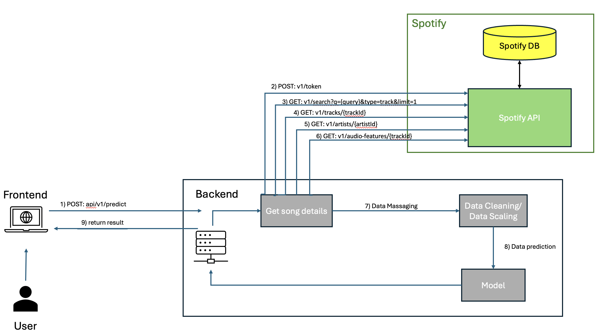

# Predicting Spotify Top 100 Hits


This repository contains the submission for the "Predicting Spotify Top 100 Hits" project, part of the ITI105 Machine Learning Project module in the Specialist Diploma in Applied Artificial Intelligence at Nanyang Polytechnic.

## Project Overview

The objective of this project is to develop a machine learning model capable of predicting whether a song will appear in Spotify's Top 100 chart. This project includes data exploration, preprocessing, feature engineering, model selection, hyperparameter tuning, and the deployment of the model as a web application.

## Web Application

You can test the prototype of the web application [here](https://spotify-top-100-track-classifier.onrender.com/).

*Note: This is a prototype and is intended for demonstration purposes only. The performance and features may not fully represent a production-ready system.*

## Application Architecture

The following diagram illustrates the flow of the application, from the frontend's API call to the backend, through the various steps such as querying the Spotify API, processing the data, scaling, and finally predicting whether a song will make it to Spotify's Top 100 using the machine learning model.



*Note: This image is for illustration purposes and describes the order of API calls, the data processing steps, and the prediction using the trained model.*


## Disclaimer

This project is primarily for educational purposes and may not fully adhere to industry standards. While it covers essential aspects of machine learning, data analysis, and model deployment, a professional implementation in a real-world scenario would likely require more rigorous data validation, advanced feature engineering, comprehensive model evaluation, and ongoing maintenance.

The focus of this project is on classical machine learning techniques, as outlined in the ITI105 module. The project does not explore more advanced topics such as deep learning or neural networks.

## Dataset

The datasets used for this project are included in this repository. You can find them in the `datasets` directory:

- `datasets/Final_Updated_Spotify_Top_100.csv`: Spotify Top 100 Songs dataset (2016-2019)
- `datasets/scleaned_unique_tracks_2015_2019_flattened.csv`: A subset of the Spotify Million Playlist Dataset used for this project

## Project Structure

The project files are organized as follows:
```
.
├── dataset
│   ├── cleaned_unique_tracks_2015_2019_flattened.csv     # Million Playlist Dataset subset
│   └── Final_Updated_Spotify_Top_100.csv      # Top 100 Songs dataset
├── preprocessing_scripts
│   ├── 01_query_audio_features_and_genre.py   # Queries Spotify API for audio features and genres
│   ├── 02_filter_unique_tracks.py             # Filters and matches songs based on dates
│   ├── 03_flatten_json_to_csv.py              # Converts JSON responses to CSV
│   └── 04_top_100_query_features.py           # Ensures consistency in Top 100 dataset
├── notebooks
│   └── project_workfile.ipynb        # Jupyter notebook for EDA and model training
├── app
│   ├── model                           # Model files for the web application
│   ├── static                          # Static files (CSS, JavaScript, images)
│   ├── templates                       # HTML templates for the web application
│   ├── app.py                          # Web application code
│   └── requirements.txt                # List of dependencies
└── README.md
```

## Results

The results of the project, including key insights and performance metrics of the machine learning models, are documented within the Jupyter notebook and the deployed web application. The XGBoost model was identified as the best-performing model, balancing precision and recall effectively.

## Summary of the Project

This project involved the following key steps:

1. **Data Exploration and Understanding:** Analyzing and visualizing the datasets to uncover trends and patterns.
2. **Data Preparation:** Cleaning the data, handling missing values, and performing feature engineering.
3. **Model Selection:** Comparing multiple machine learning models, including Logistic Regression, Random Forest, XGBoost, SVM, Gradient Boosting, and an Ensemble Voting Classifier.
4. **Performance Measurement:** Evaluating the models using metrics such as accuracy, precision, recall, F1 score, and ROC-AUC.
5. **Hyperparameter Tuning:** Optimizing model parameters using GridSearchCV to enhance performance.
6. **Deployment:** Deploying the best-performing model as a web application on Render.com, allowing users to input a song's name or ID and receive a prediction.

## Future Work

To further improve the project, the following areas could be explored:

- **Expanding the Dataset:** Incorporating more data from the Spotify Million Playlist dataset and recent Top 100 songs.
- **Advanced Hyperparameter Tuning:** Further optimizing the models, particularly SVM and the Ensemble model.
- **Web Application Enhancements:** Improving the user interface and adding more features to the web application.
- **Exploring Additional Features:** Testing new features for model training to refine predictions.
- **Leveraging MLflow:** Utilizing MLflow more extensively for detailed experiment tracking and logging.

## Contributions

This project was a collaborative effort, with the following contributions:

- **Feng Long (Zell)**
  - Responsible for data cleaning, initial exploratory data analysis (EDA), and feature engineering.
  - Contributed to model training and experimentation.
  - Integrated MLflow for experiment tracking and model management.

- **Kah Seng**
  - Responsible for data collection and API integration with the Spotify API.
  - Contributed to model training and experimentation.
  - Led the web application and deployment on Render.com, ensuring seamless integration with the backend.

This project benefited from the combined expertise in data science, machine learning, and web development, resulting in a comprehensive and well-executed solution.


## References

- [Kaggle: Spotify Top 100 Songs of 2015-2019](https://www.kaggle.com/datasets/muhmores/spotify-top-100-songs-of-20152019)
- [Spotify Million Playlist Dataset](https://www.aicrowd.com/challenges/spotify-million-playlist-dataset-challenge/dataset_files)
- [Spotify API Documentation](https://developer.spotify.com/documentation/web-api)
- [Render.com Documentation](https://docs.render.com/)
- [ITI105 Project Guide](https://github.com/nyp-sit/iti105/blob/main/project-guide.md)


## License
This project is licensed under the MIT License.
